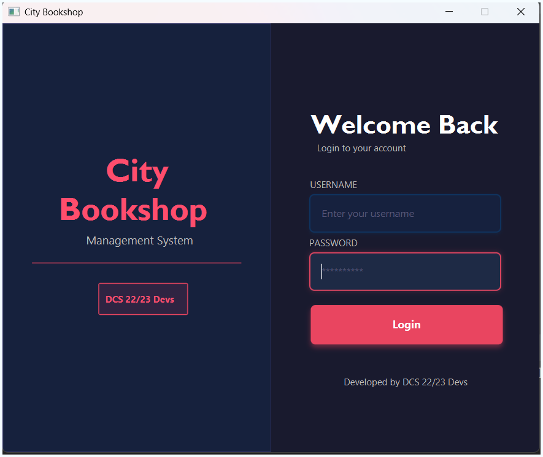
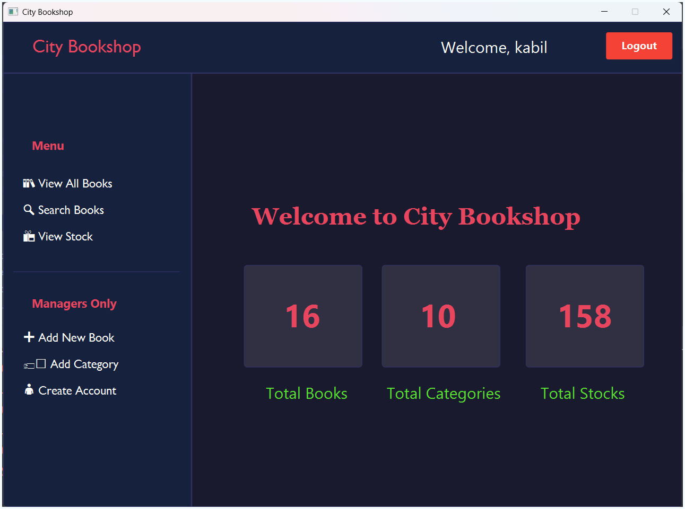
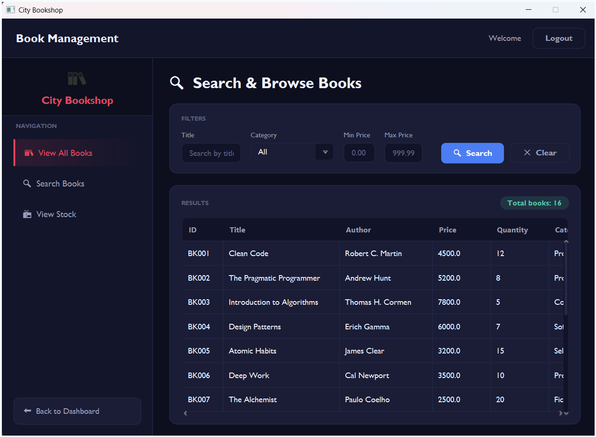
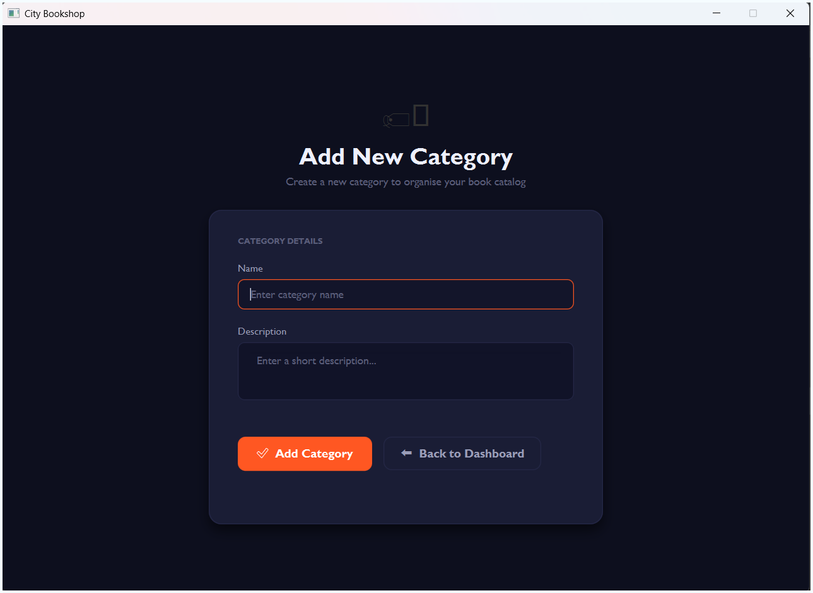
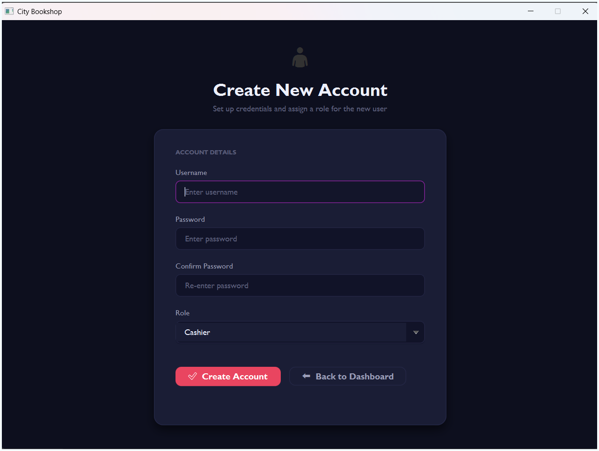

# 📚 City Bookshop — OOP Group Assessment

[](https://www.oracle.com/java/)
[](https://openjfx.io/)
[](LICENSE)
[](https://github.com/KabileshwaranKabil/CityBookshop-JavaFX)

> A Java-based Bookshop Management System developed as a group assignment for the Object-Oriented Programming module. The system automates bookshop transactions using core OOP principles with a JavaFX graphical interface and file-based data storage.

---

## 📋 Table of Contents

- [📚 City Bookshop — OOP Group Assessment](#-city-bookshop--oop-group-assessment)
  - [📋 Table of Contents](#-table-of-contents)
  - [🎯 System Overview](#-system-overview)
  - [Features](#features)
  - [Technologies Used](#technologies-used)
  - [Project Structure](#project-structure)
  - [OOP Concepts Applied](#oop-concepts-applied)
  - [Application Screens](#application-screens)
  - [Data Storage Format](#data-storage-format)
  - [Installation Guide](#installation-guide)
    - [Prerequisites](#prerequisites)
    - [Steps](#steps)
    - [Troubleshooting](#troubleshooting)
  - [Usage](#usage)
  - [Contributing](#contributing)
    - [How to Contribute](#how-to-contribute)
    - [Guidelines](#guidelines)
    - [Reporting Issues](#reporting-issues)
  - [License](#license)
  - [Acknowledgments](#acknowledgments)
  - [Group Members](#group-members)
  - [Application Gallery](#application-gallery)


---

## 🎯 System Overview

**City Bookshop** is a desktop application that supports two user roles:

**Cashier**

- View all books
- Search books by name, category, and price
- View stock levels

**Manager** _(all Cashier features plus)_

- Add new books and categories
- Create new user accounts (Cashier or Manager)

---

## Features

- **User Authentication**: Secure login system with role-based access control
- **Book Management**: Add, view, and search books with detailed information
- **Category Management**: Organize books into categories
- **Stock Tracking**: Monitor inventory levels
- **User Management**: Create and manage user accounts (Manager only)
- **File-Based Storage**: Persistent data storage using plain text files
- **Intuitive GUI**: User-friendly interface built with JavaFX

---

##  Technologies Used

| Technology    | Purpose                           |
| ------------- | --------------------------------- |
| Java JDK 17+  | Core programming language         |
| JavaFX        | Graphical User Interface          |
| Java File I/O | Data storage and retrieval        |
| Scene Builder | FXML screen design                |
| Git & GitHub  | Version control and collaboration |

---

## Project Structure

```
CityBookshop/
│
├── src/
│   └── com/citybookshop/
│       ├── Main.java            
│       │
│       ├── model/
│       │   ├── User.java
│       │   ├── Cashier.java
│       │   ├── Manager.java
│       │   ├── Book.java
│       │   └── Category.java
│       │
│       ├── service/
│       │   ├── FileHandler.java
│       │   ├── UserService.java
│       │   ├── BookService.java
│       │   └── CategoryService.java
│       │
│       ├── controller/
│       │   ├── LoginController.java
│       │   ├── DashboardController.java
│       │   ├── BookController.java
│       │   ├── StockController.java
│       │   ├── AddBookController.java
│       │   ├── AddCategoryController.java
│       │   └── AccountController.java
│       │
│       └── view/
│           ├── Login.fxml
│           ├── Dashboard.fxml
│           ├── Books.fxml
│           ├── Stock.fxml
│           ├── AddBook.fxml
│           ├── AddCategory.fxml
│           └── CreateAccount.fxml
│
├── data/
│   ├── books.txt
│   ├── categories.txt
│   └── users.txt
│
└── docs/
    └── Assignment_Specification.pdf
```

---

## OOP Concepts Applied

| Concept            | Where It Is Applied                                          |
| ------------------ | ------------------------------------------------------------ |
| **Class & Object** | `Book`, `User`, `Category` classes instantiated as objects   |
| **Encapsulation**  | All fields are `private` with getters and setters            |
| **Inheritance**    | `Cashier` and `Manager` both extend abstract `User`          |
| **Abstraction**    | `User` is abstract with abstract method `getDetails()`       |
| **Polymorphism**   | `getDetails()` behaves differently in `Manager` vs `Cashier` |

---

## Application Screens

| Screen         | Access                      |
| -------------- | --------------------------- |
| Login          | All users                   |
| Dashboard      | All users (role-based menu) |
| View Books     | All users                   |
| Search Books   | All users                   |
| View Stock     | All users                   |
| Add New Book   | Manager only                |
| Add Category   | Manager only                |
| Create Account | Manager only                |

---

## Data Storage Format

All data is stored in plain text files inside the `/data` folder.

**users.txt**

```
USR001|admin|123|Manager
USR002|kabil|1896|Manager
```

**books.txt**

```
BK001|Clean Code|Robert C. Martin|4500|12|Programming
BK002|The Pragmatic Programmer|Andrew Hunt|5200|8|Programming
BK003|Introduction to Algorithms|Thomas H. Cormen|7800|5|Computer Science
BK004|Design Patterns|Erich Gamma|6000|7|Software Engineering
```

**categories.txt**

```
CT001|Programming|Books related to software development, coding practices, and programming languages
CT002|Computer Science|Core computer science concepts including algorithms, data structures, and systems
```

---

##  Installation Guide

### Prerequisites

- **Java JDK 17 or higher**: Download from [Oracle](https://www.oracle.com/java/technologies/javase/jdk17-archive-downloads.html) or use OpenJDK
- **JavaFX SDK**: Download from [Gluon](https://gluonhq.com/products/javafx/)
- **IDE**: IntelliJ IDEA, Eclipse, or VS Code with Java support

### Steps

1. **Clone the repository**

   ```bash
   git clone https://github.com/KabileshwaranKabil/CityBookshop-JavaFX.git
   cd CityBookshop-JavaFX
   ```

2. **Open the project in your IDE**

   - For IntelliJ IDEA: File > Open > Select the project folder
   - For Eclipse: File > Import > Existing Projects into Workspace

3. **Add JavaFX SDK to the project**

   - In IntelliJ IDEA: File > Project Structure > Libraries > Add JavaFX SDK
   - In Eclipse: Right-click project > Properties > Java Build Path > Libraries > Add External JARs

4. **Configure VM options**

   Add the following VM options to your run configuration:

   ```
   --module-path /path/to/javafx-sdk/lib --add-modules javafx.controls,javafx.fxml
   ```

   Replace `/path/to/javafx-sdk` with the actual path to your JavaFX SDK.

5. **Run the application**

   - Run `Main.java` as the main class
   - The application will start and display the login screen

6. **Login with default credentials**

   ```
   Username: admin
   Password: 123
   ```

### Troubleshooting

- If you encounter JavaFX-related errors, ensure the module path and add-modules are correctly set
- Make sure your JDK version is 17 or higher
- Check that all FXML files are in the correct path

---

## Usage

1. **Login**: Enter your username and password
2. **Dashboard**: Navigate through different sections based on your role
3. **View Books**: Browse and search the book catalog
4. **Manage Stock**: Check inventory levels
5. **Add Books/Categories**: (Manager only) Add new items to the system
6. **User Management**: (Manager only) Create new user accounts

---

##  Contributing

We welcome contributions to improve the City Bookshop project! Here's how you can contribute:

### How to Contribute

1. **Fork the repository** on GitHub
2. **Create a feature branch**: `git checkout -b feature/your-feature-name`
3. **Make your changes** and ensure they follow the project's coding standards
4. **Test your changes** thoroughly
5. **Commit your changes**: `git commit -m 'Add some feature'`
6. **Push to the branch**: `git push origin feature/your-feature-name`
7. **Open a Pull Request** on GitHub

### Guidelines

- Follow Java naming conventions
- Add comments to complex logic
- Ensure all new code includes appropriate error handling
- Update documentation if necessary
- Test your changes before submitting

### Reporting Issues

If you find a bug or have a feature request, please open an issue on GitHub with:
- A clear title and description
- Steps to reproduce (for bugs)
- Expected vs. actual behavior
- Screenshots if applicable

---

## License

This project is licensed under the MIT License - see the [LICENSE](LICENSE) file for details.

--- 

## Acknowledgments

- Special thanks to our OOP lecturer for the guidance and assignment specification
- Appreciation to the open-source community for the tools and libraries used
- Thanks to all group members for their collaboration

---

## Group Members

| Name             | Email                         |
| ---------------- | ----------------------------- |
| M. Kabileshwaran | kabileshwaran1896@gmail.com   |
| M. Dinush Khan   | dinushkhan1214@gmail.com      |
| Praveen          | praveenvimukthi2003@gmail.com |
| Indunil          | indunilexm2022@gmail.com      |
| Aakash           | akashliyanage16@gmail.com     |

--- 

## Application Gallery

Explore the user interface of the City Bookshop application through the following gallery:

| Login Page | Dashboard |
|------------|-----------|
|  |  |

| View Books | View Stocks |
|------------|-------------|
|  |  |

| Add New Book | Add New Category |
|--------------|------------------|
|  |  |

| Add New User |
|--------------|
|  |

---

**Developed by DCS 22/23 Devs**  
*OOP Group Assignment · 2026*  

If you find this project useful, please consider giving it a ⭐ on GitHub!
